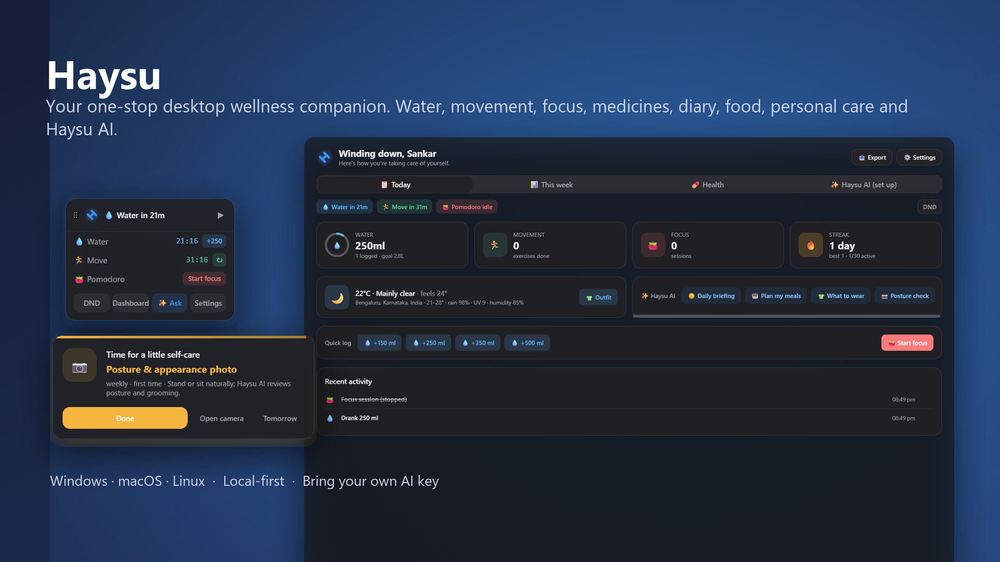
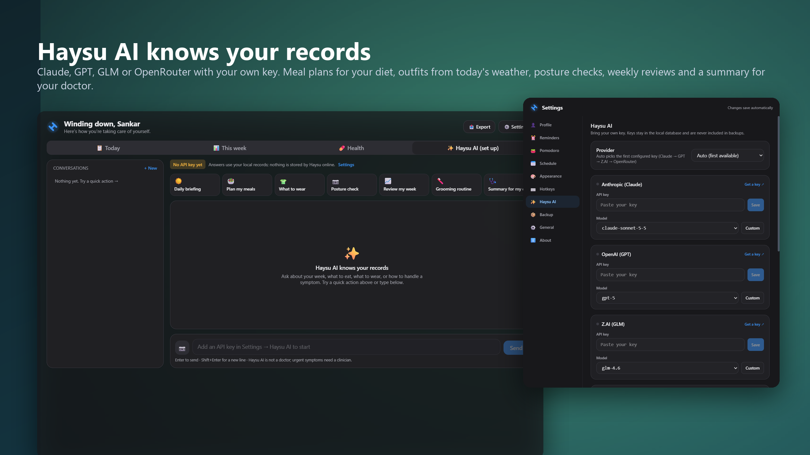

# Haysu

**Your desktop wellness companion.** Water reminders, movement breaks, a Pomodoro
timer, medicines, a health diary, personal-care routines and an AI companion that
knows your records, all living quietly in your system tray.

[](https://github.com/sankar-mechengg/haysu-wellness-companion-desktop-win-mac-app/actions/workflows/ci.yml)
[](https://github.com/sankar-mechengg/haysu-wellness-companion-desktop-win-mac-app/releases/latest)


## Download

Grab the latest build from the
[Releases page](https://github.com/sankar-mechengg/haysu-wellness-companion-desktop-win-mac-app/releases/latest):

| Platform            | File                                  |
| ------------------- | ------------------------------------- |
| Windows 10 / 11     | `Haysu_x.y.z_x64-setup.exe` or `.msi` |
| macOS Apple Silicon | `Haysu_x.y.z_aarch64.dmg`             |
| macOS Intel         | `Haysu_x.y.z_x64.dmg`                 |
| Linux               | `Haysu_x.y.z_amd64.AppImage` / `.deb` |

Builds are not code-signed yet. Windows SmartScreen shows *More info → Run anyway*;
on macOS use **System Settings → Privacy & Security → Open Anyway** after the first
launch attempt. Once installed, Haysu updates itself from GitHub releases.

## Screenshots





More in [`docs/screenshots`](docs/screenshots): every dashboard and settings tab in
light and dark, the widget, and reminder popups.

## Features

- **Water reminders** with a weight-based daily goal, quick amounts, snooze, and skip
  tracking.
- **Movement breaks** from a catalogue of 40 exercises (upper body, lower body, eyes,
  breathing). Exercises match your work style; a built-in timer counts the stretch down.
- **Pomodoro timer** with configurable work / short break / long break lengths and
  optional auto-start.
- **Away detection and work hours**: countdowns pause when you step away or outside
  your schedule, so you never return to a pile of reminders.
- **Do Not Disturb** on demand or timed (30 min, 1 h, 2 h, rest of day).
- **Floating widget** that shows what's next, with Pomodoro and DND controls. Drag it
  anywhere; it remembers where it was.
- **Dashboard** with daily and weekly stats, streaks, charts and JSON / CSV export.
- **Global hotkeys**, fully customisable: toggle Pomodoro, toggle DND, open the
  dashboard, log a glass of water.
- **Native notifications** as an alternative (or addition) to the popup.
- **Medicine reminders** with Taken / Snooze / Skip, missed-dose tracking and adherence.
  They fire even during Do Not Disturb.
- **Health diary** for mood, energy, pain, sleep, symptoms and notes, tied to the
  conditions you're managing, plus vitals (weight, blood pressure, heart rate,
  temperature, glucose, SpO₂) with trend charts.
- **Haysu AI**: bring your own Anthropic, OpenAI, Z.AI or OpenRouter key and ask
  anything about your week, food, sleep or symptoms. Quick actions for a daily
  briefing, meal plans that fit your diet, what to wear from today's weather, a
  posture / grooming photo check, a weekly review and a summary for your doctor.
- **Food log** and **personal-care routines** (skincare, haircut, dentist, weigh-in,
  posture photo, …) with their own reminders.
- **Backup**: `.hay` full backups and `.su` health snapshots, automatic daily
  backups, merge or replace on import, and a Markdown health report.
- **Light, dark (grey or blue) and system theme**, Windows 11 Mica / macOS vibrancy,
  animations you can switch off. Launch at login. In-app updater.

Everything is stored locally in a SQLite file. The only network calls are GitHub
(updates), Open-Meteo (weather, if you set a city) and the AI provider you chose,
and only when you ask Haysu AI something.

## Development

Requirements: Node 20+, Rust stable, and the
[Tauri prerequisites](https://v2.tauri.app/start/prerequisites/) for your OS
(WebView2 on Windows, Xcode CLT on macOS, webkit2gtk + libxss on Linux).

```bash
npm install
npm run tauri dev
```

Useful scripts:

| Script                   | What it does                                            |
| ------------------------ | ------------------------------------------------------- |
| `npm run check`          | Typecheck, lint and run the frontend tests              |
| `npm run format`         | Prettier                                                |
| `npm run tauri build`    | Produce installers for the current OS in `src-tauri/target/release/bundle` |
| `npm run bump -- 1.2.0`  | Set the version in every manifest (or `patch`, `minor`, `major`) |

Rust side:

```bash
cd src-tauri
cargo test
cargo clippy --all-targets -- -D warnings
```

### Project layout

```
src/                 React + TypeScript UI (one SPA, routed by ?window=)
  windows/           widget · popup · dashboard · settings · onboarding
  components/        UI per window plus shared controls
  lib/api.ts         typed bridge to every Rust command and event
src-tauri/src/
  scheduler/         countdowns, Pomodoro state machine, schedule, idle detection, dose tracker
  health/            medicines, diary, conditions, measurements (models + SQL)
  commands/          Tauri commands (config, stats, export, timers, system)
  config.rs          typed AppConfig persisted in the settings table
  db/                SQLite bootstrap, migrations, models, timestamp helpers
  tray.rs · hotkeys.rs · windows.rs · autostart.rs · notify.rs
docs/AUDIT.md        the 1.0.x audit that drove the 1.1 rebuild
```

## Releasing

1. `npm run bump -- 1.2.0` and update `CHANGELOG.md`.
2. Commit, tag `v1.2.0`, push the tag.
3. The **Release** workflow verifies the tag matches the manifests, builds Windows,
   macOS (both architectures) and Linux, signs the updater artefacts, and publishes
   the GitHub release with notes taken from the changelog.

The workflow needs the `TAURI_SIGNING_PRIVATE_KEY` repository secret (the updater
signing key). Optional Apple signing secrets are read if present.

## License

MIT
